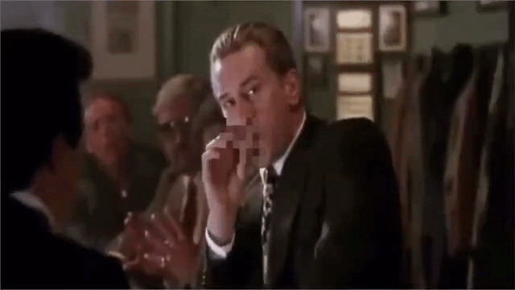
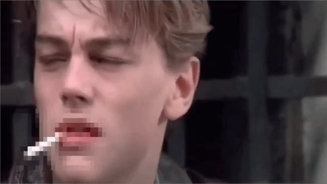
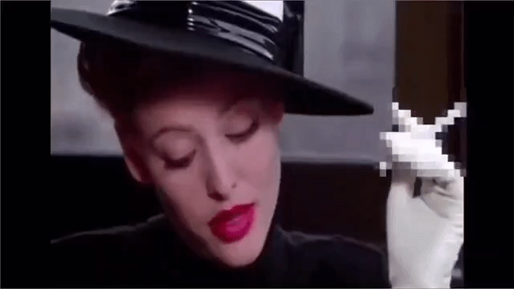

# Smoking Detection

## 목차

- [프로젝트 주제](#프로젝트-주제)
- [프로젝트 목적](#프로젝트-목적)
- [프로젝트 기능](#프로젝트-기능)
- [데이터 수집](#데이터-수집)
- [라벨링](#라벨링)
- [학습 결과](#학습-결과)
- [데모 영상](#데모-영상)

## 프로젝트 주제

흡연 장면을 자동으로 감지하자.

## 프로젝트 목적

  - 횡단보도, 버스 정류장 등 금연 구역에서 흡연하는 사람들을 자동 감지해서 기록한다.
  - 영화나 드라마 속 흡연 장면에서 담배를 자동으로 모자이크한다.

## 프로젝트 기능

## 데이터 수집

kaggle cigarette dataset [다운로드](https://www.kaggle.com/datasets/lurenzhouyi/cigarette-dataset)

## 라벨링

## 학습 결과

## 데모 영상

[데모 영상 바로 가기](demo/video)

- [프로젝트 소개 바로 가기](smoking_detection.pdf)
- [커밋 컨벤션 바로 가기](.github/CONTRIBUTING.md)
